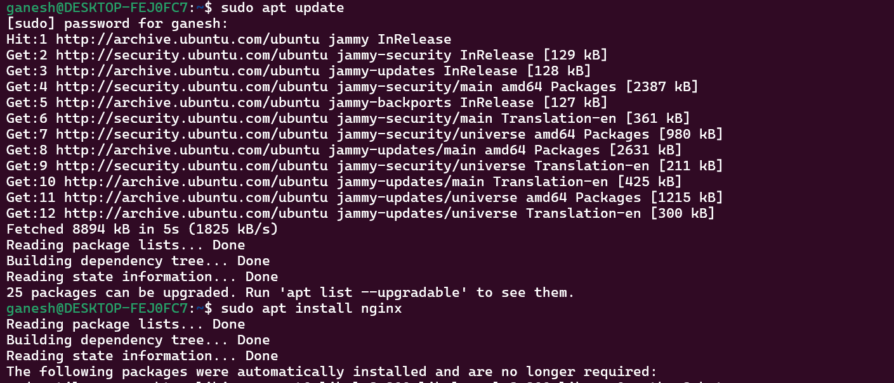
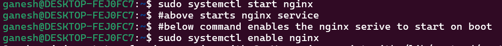
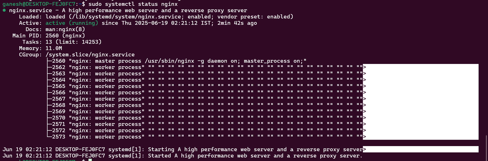
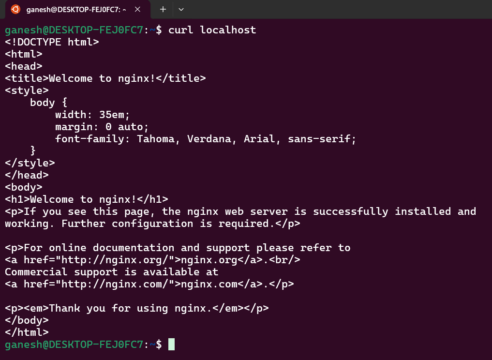

# 2 Day Task Circles Guild

## Install nginx and curl localhost

### Step 1: Updating the apt and installing nginx

```bash
sudo apt update
sudo apt install nginx
```


### Step 2: Systemctl commands to start the nginx service and enable it on boot

```bash
sudo systemctl start nginx
sudo systemctl enable nginx
```


### Step 3: Systemctl commands to Check the status of the nginx service

```bash
sudo systemctl status nginx
```


### Step 4: curl localhost and check if the nginx web page is served

```bash
curl localhost
```
